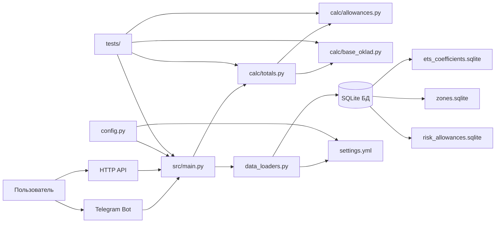
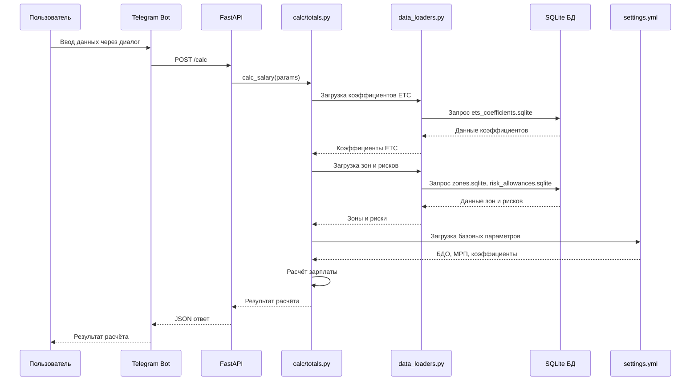
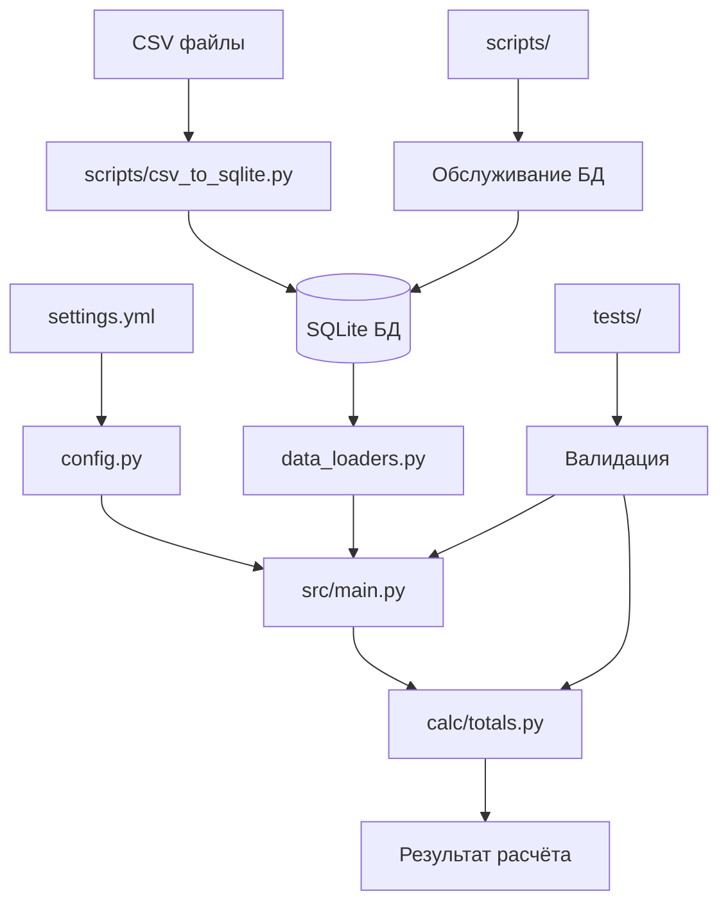
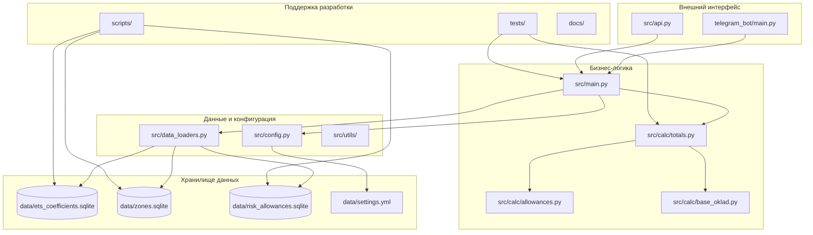
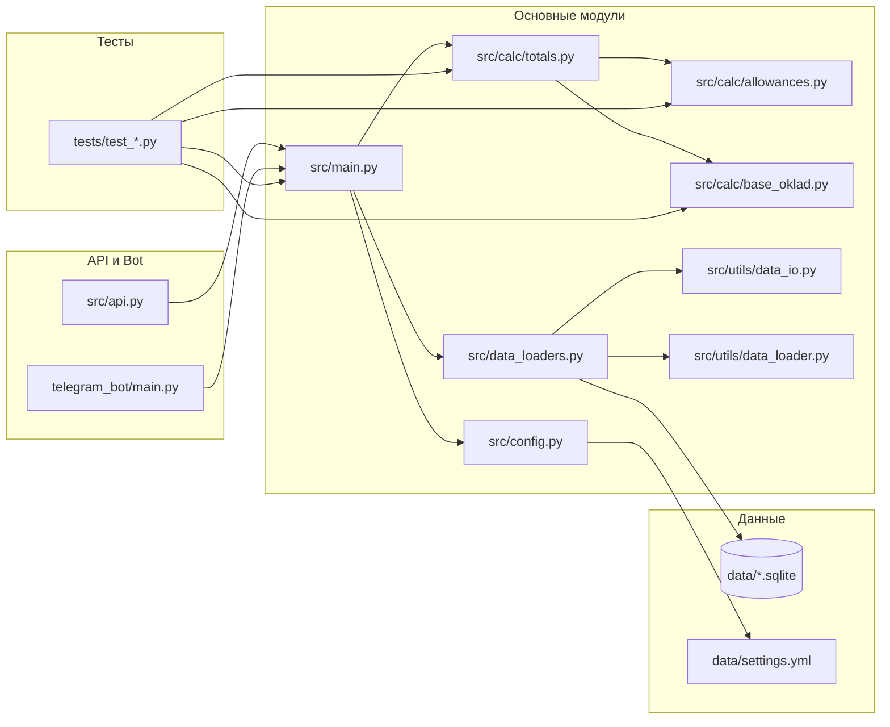
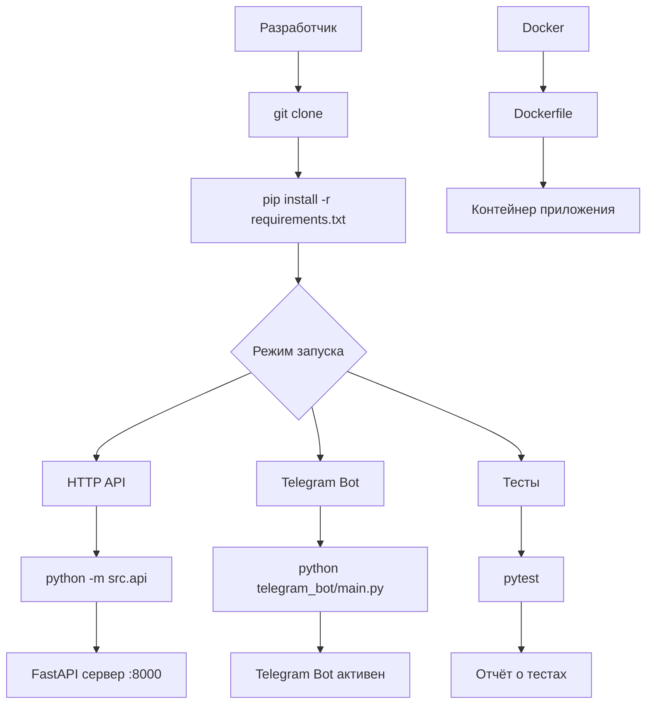

# Архитектура проекта med-salary-bot-kz

Этот документ описывает архитектуру папок и файлов проекта с использованием диаграмм.

## Обзор архитектуры

Проект представляет собой систему для расчёта заработной платы медицинских работников Казахстана, состоящую из:
- HTTP API (FastAPI)
- Telegram Bot
- Модулей расчёта зарплаты
- Базы данных SQLite
- Документации и тестов

## Структура папок проекта

```mermaid
graph TD
    A[med-salary-bot-kz] --> B[src/]
    A --> C[telegram_bot/]
    A --> D[data/]
    A --> E[docs/]
    A --> F[tests/]
    A --> G[scripts/]
    A --> H[.github/]
    
    B --> B1[api.py - FastAPI сервер]
    B --> B2[main.py - основная логика]
    B --> B3[config.py - конфигурация]
    B --> B4[data_loaders.py - загрузка данных]
    B --> B5[calc/ - модули расчёта]
    B --> B6[utils/ - утилиты]
    
    B5 --> B51[totals.py - итоговые расчёты]
    B5 --> B52[allowances.py - надбавки]
    B5 --> B53[base_oklad.py - базовый оклад]
    
    B6 --> B61[data_io.py - ввод/вывод данных]
    B6 --> B62[data_loader.py - загрузчик данных]
    
    C --> C1[main.py - Telegram бот]
    C --> C2[README.md - документация бота]
    C --> C3[bot_tests/ - тесты бота]
    
    D --> D1[ets_coefficients.sqlite - коэффициенты ЕТС]
    D --> D2[zones.sqlite - экологические зоны]
    D --> D3[risk_allowances.sqlite - вредные условия]
    D --> D4[settings.yml - настройки]
    D --> D5[*.csv - CSV данные]
    
    E --> E1[README.md - обзор документации]
    E --> E2[calc-model.md - модель расчёта]
    E --> E3[dialogs.md - диалоги бота]
    E --> E4[TZ.md - техзадание]
    
    F --> F1[test_*.py - тесты модулей]
    F --> F2[conftest.py - конфигурация тестов]
    
    G --> G1[*.py - скрипты обслуживания]
    G --> G2[*.sh - bash скрипты]
    
    H --> H1[workflows/ - CI/CD]
```

## Архитектура компонентов

## Поток данных

## Жизненный цикл данных

## Модульная архитектура

## Зависимости файлов

## Развертывание и запуск

Эта документация предоставляет полное представление об архитектуре проекта, включая структуру папок, взаимодействие компонентов, поток данных и зависимости между модулями.