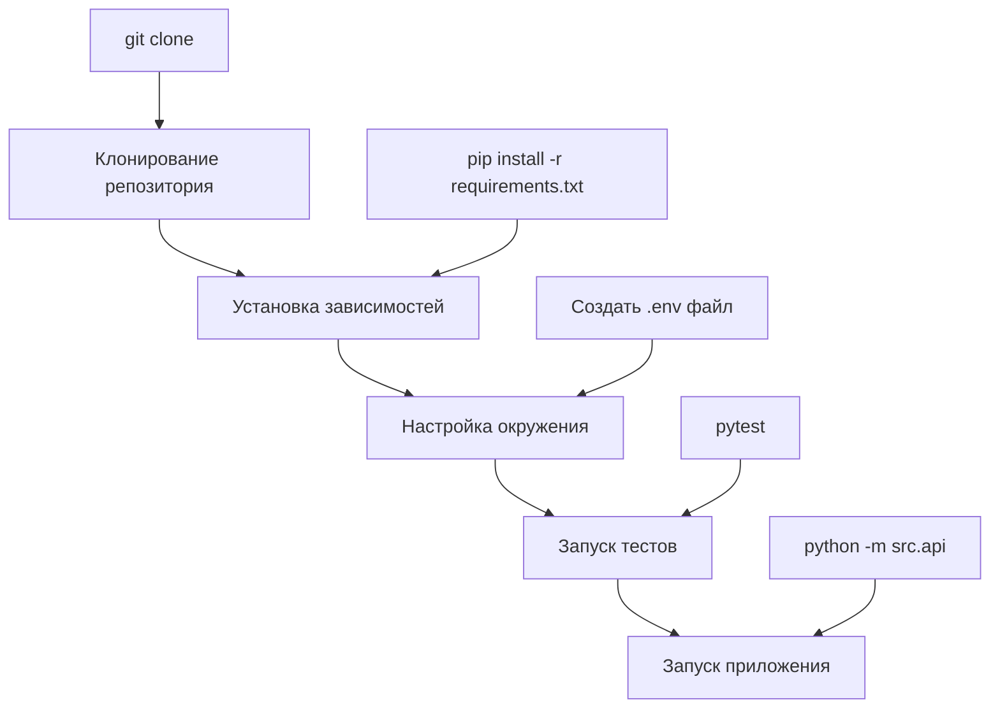
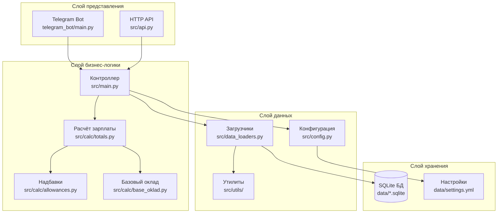
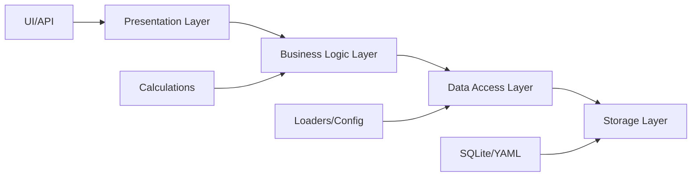
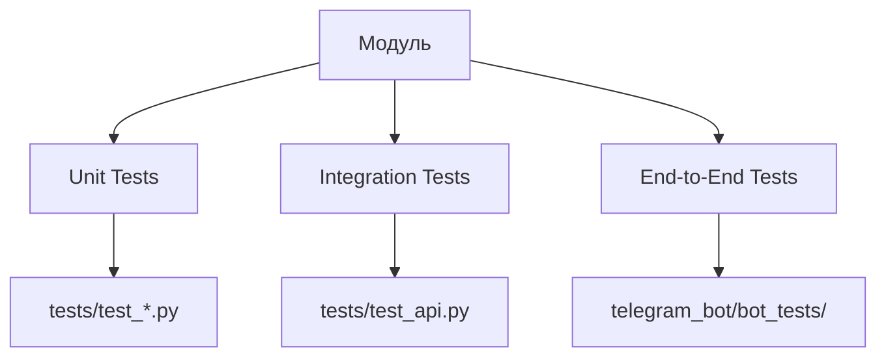
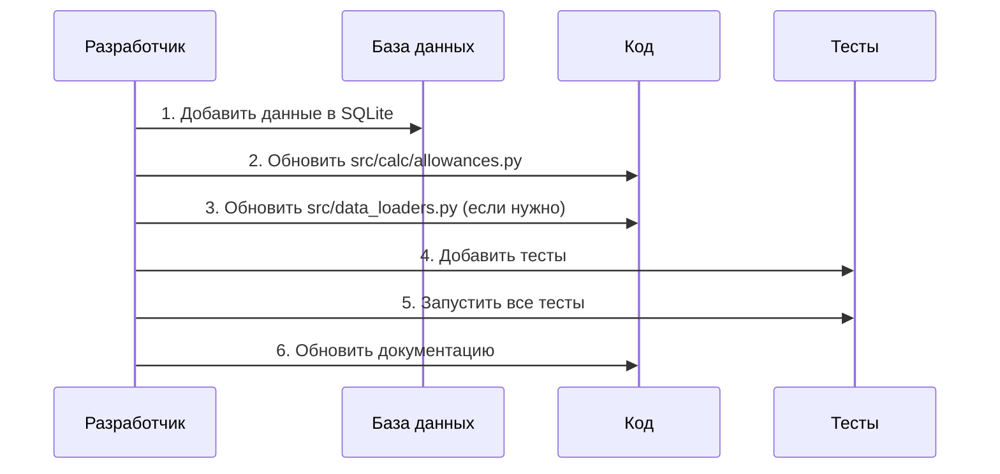
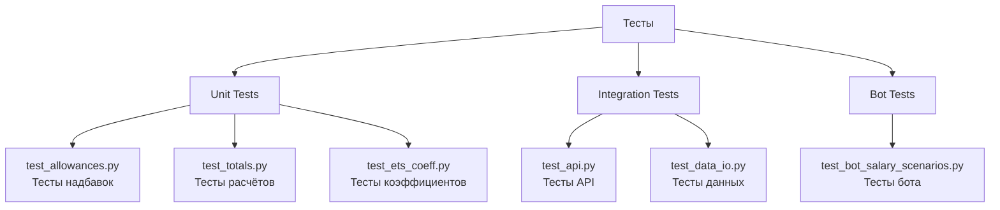
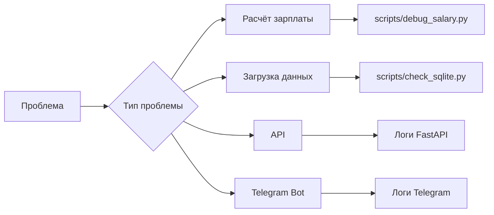
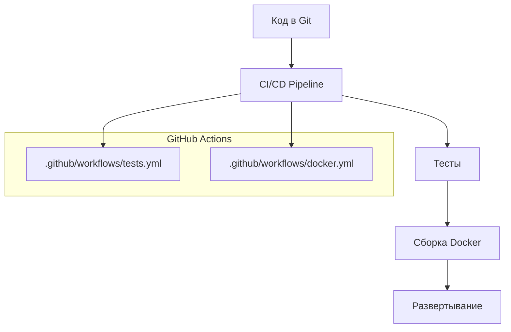

# Руководство разработчика

Это руководство поможет разработчикам понять архитектуру проекта и начать разработку.

## Быстрый старт



## Архитектурные слои



## Принципы архитектуры

### 1. Разделение ответственности



### 2. Модульность

Каждый модуль имеет четко определенную ответственность:

- **src/api.py** - HTTP интерфейс
- **telegram_bot/main.py** - Telegram интерфейс
- **src/main.py** - Координация бизнес-логики
- **src/calc/** - Расчётные модули
- **src/data_loaders.py** - Управление данными
- **src/config.py** - Управление конфигурацией

### 3. Тестируемость



## Добавление новой функциональности

### Пример: Добавление нового типа надбавки



### Шаги разработки:

1. **Анализ требований**
   - Изучить существующую логику в `src/calc/`
   - Понять структуру данных в `data/*.sqlite`

2. **Изменение данных**
   - Обновить соответствующую SQLite базу
   - Или обновить `data/settings.yml` для конфигурации

3. **Обновление кода**
   - Модифицировать функции в `src/calc/allowances.py`
   - При необходимости обновить `src/data_loaders.py`

4. **Тестирование**
   - Добавить unit тесты в `tests/`
   - Запустить `pytest` для проверки

5. **Интеграция**
   - Проверить работу через `src/api.py`
   - Проверить работу через `telegram_bot/main.py`

## Структура тестирования



## Отладка и диагностика

### Инструменты отладки



### Использование скриптов отладки:

```bash
# Проверка базы данных
python scripts/check_sqlite.py

# Отладка расчёта зарплаты
python scripts/debug_salary.py

# Быстрые проверки
python scripts/smoke_check.py
```

## Развертывание



## Лучшие практики

1. **Код**
   - Следовать принципам SOLID
   - Использовать типизацию Python
   - Документировать функции docstrings

2. **Тесты**
   - Покрывать новый код тестами
   - Использовать pytest fixtures
   - Тестировать edge cases

3. **Данные**
   - Не изменять SQLite напрямую в продакшене
   - Использовать миграции через скрипты
   - Валидировать данные перед использованием

4. **Документация**
   - Обновлять диаграммы при изменении архитектуры
   - Документировать новые API endpoints
   - Поддерживать актуальность README

Эта архитектура обеспечивает гибкость, maintainability и масштабируемость проекта для расчёта заработной платы медицинских работников Казахстана.