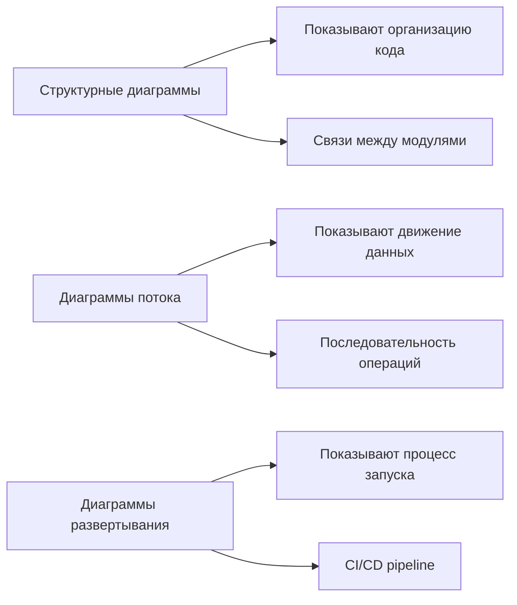
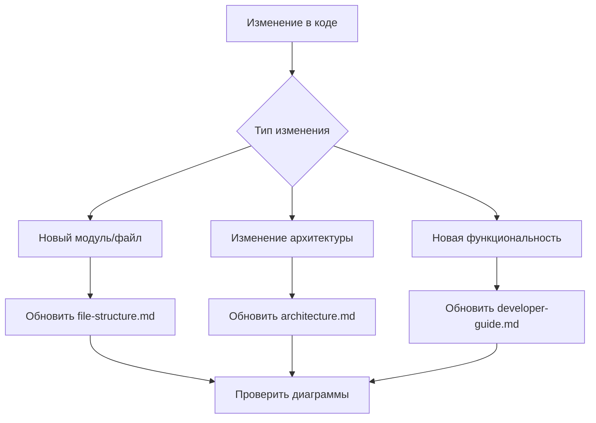

# Как использовать документацию архитектуры

Этот файл объясняет, как использовать созданную документацию для понимания и работы с проектом.

## Обзор созданных документов

### 1. `architecture.md` - Архитектура проекта
**Для кого**: Архитекторы, ведущие разработчики, DevOps
**Содержит**:
- Общий обзор архитектуры системы
- Диаграммы взаимодействия компонентов
- Поток данных через систему
- Модульную архитектуру

### 2. `file-structure.md` - Структура файлов
**Для кого**: Новые разработчики, тестировщики
**Содержит**:
- Детальное описание каждой папки и файла
- Назначение и роль каждого модуля
- Цветовое кодирование по типам файлов
- Таблицу ролей ключевых файлов

### 3. `developer-guide.md` - Руководство разработчика  
**Для кого**: Разработчики, контрибьюторы
**Содержит**:
- Принципы архитектуры
- Процесс добавления новой функциональности
- Инструменты отладки и диагностики
- Лучшие практики

## Как читать диаграммы

### Типы диаграмм



### Условные обозначения

| Символ | Значение |
|--------|----------|
| 📄 | Файл Python |
| 📁 | Папка/директория |
| 📖 | Документация |
| 💾 | База данных SQLite |
| ⚙️ | Конфигурационный файл |
| 🧪 | Тестовый файл |
| 🔧 | Служебный скрипт |
| 📜 | Shell скрипт |

### Цветовое кодирование

- **Синий** (#e1f5fe) - API и пользовательские интерфейсы
- **Зелёный** (#e8f5e8) - Основная бизнес-логика
- **Оранжевый** (#fff3e0) - Вычислительные модули
- **Жёлтый** (#ffecb3) - Данные и хранилище
- **Фиолетовый** (#f3e5f5) - Тесты

## Сценарии использования документации

### Для нового разработчика
1. Читать `README.md` (общий обзор)
2. Изучить `architecture.md` (понять общую структуру)
3. Просмотреть `file-structure.md` (понять назначение файлов)
4. Использовать `developer-guide.md` (для начала разработки)

### Для архитектурных решений
1. Анализировать диаграммы в `architecture.md`
2. Изучить принципы в `developer-guide.md`
3. Планировать изменения с учетом модульности

### Для отладки
1. Использовать поток данных из `architecture.md`
2. Найти ответственный модуль в `file-structure.md`
3. Применить инструменты из `developer-guide.md`

## Поддержка документации

### Когда обновлять



### Инструменты для просмотра диаграмм

1. **GitHub** - автоматически рендерит Mermaid диаграммы
2. **VS Code** - плагин "Markdown Preview Mermaid Support"
3. **Mermaid Live Editor** - https://mermaid.live/
4. **Typora** - редактор Markdown с поддержкой Mermaid

## Интеграция с существующей документацией

Новые документы интегрированы с существующей структурой:

```
docs/
├── README.md           ← Обновлён для включения новых документов
├── architecture.md     ← НОВЫЙ: Архитектура проекта
├── file-structure.md   ← НОВЫЙ: Структура файлов
├── developer-guide.md  ← НОВЫЙ: Руководство разработчика
├── calc-model.md       ← Существующий: Модель расчёта
├── dialogs.md          ← Существующий: Диалоги бота
└── TZ.md              ← Существующий: Техзадание
```

Основной `README.md` также обновлён для включения ссылок на новую документацию.

## Рекомендации

1. **Всегда начинайте с диаграмм** - они дают быстрое понимание
2. **Используйте поиск по файлам** - для навигации по большим диаграммам
3. **Обновляйте документацию при изменениях** - для актуальности
4. **Делитесь ссылками на конкретные разделы** - для эффективной коммуникации

Эта документация создана для того, чтобы сделать проект более понятным и поддерживаемым для всех участников разработки.