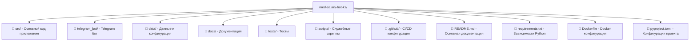
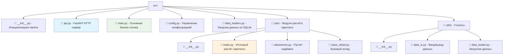
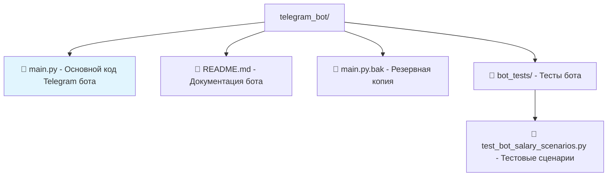
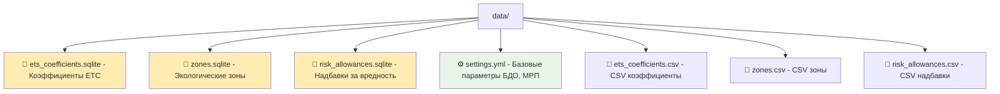
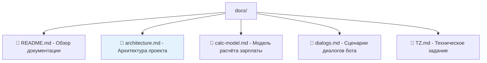
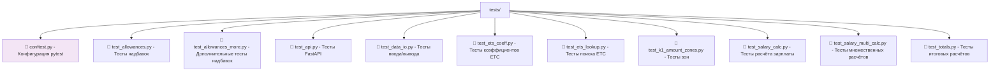
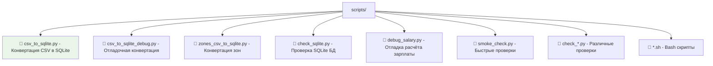
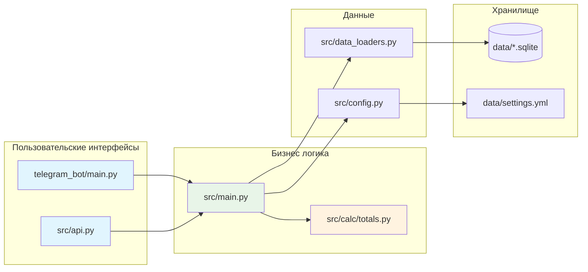
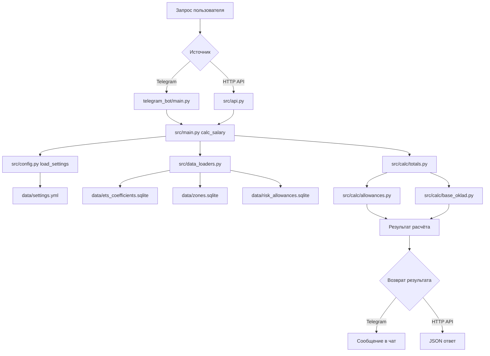

# Детальная структура файлов проекта

Этот документ содержит подробное описание назначения каждой папки и файла в проекте.

## Корневая структура

## Папка src/ - Основной код

## Папка telegram_bot/ - Telegram бот

## Папка data/ - Данные и конфигурация

## Папка docs/ - Документация

## Папка tests/ - Тесты

## Папка scripts/ - Служебные скрипты

## Взаимодействие основных файлов

## Роли ключевых файлов

| Файл | Назначение | Тип |
|------|------------|-----|
| `src/main.py` | Основная бизнес-логика расчёта зарплаты | 🏗️ Ядро |
| `src/api.py` | HTTP API интерфейс (FastAPI) | 🌐 API |
| `telegram_bot/main.py` | Telegram бот интерфейс | 🤖 Bot |
| `src/calc/totals.py` | Итоговые расчёты зарплаты | 🧮 Calc |
| `src/calc/allowances.py` | Расчёт надбавок и доплат | 💰 Calc |
| `src/data_loaders.py` | Загрузка данных из SQLite | 📊 Data |
| `src/config.py` | Управление конфигурацией | ⚙️ Config |
| `data/settings.yml` | Базовые параметры (БДО, МРП) | 📋 Config |
| `data/*.sqlite` | База данных коэффициентов | 💾 DB |

## Потоки обработки данных

Эта структура обеспечивает модульность, тестируемость и масштабируемость проекта для расчёта заработной платы медицинских работников.